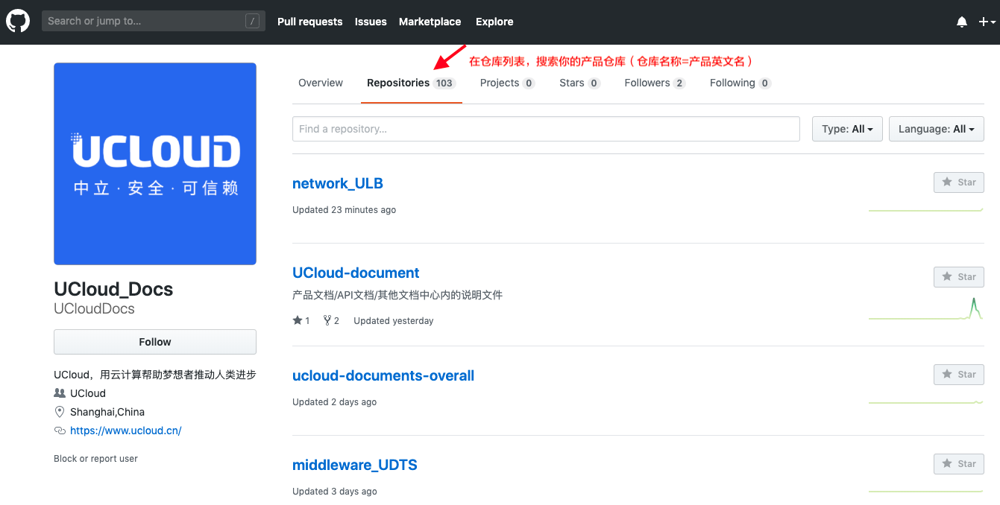

[<<返回](https://leaishere.github.io/docs_new/)

------

# 准备工作

如果你是一名产品经理，那么恭喜你。你即将开启自己顺滑的文档创作之旅。立即前往 [github](https://github.com)

### 你需要 _使用UCloud邮箱_ 注册一个Github账号

### 请将你的 _注册邮箱_ 和 _用户名_ 填写入 [信息采集表](https://ushare.ucloudadmin.com/pages/viewpage.action?pageId=17798669) ,我们将尽快为你准备好仓库、分配好权限。

* 新产品/新分类/变更原产品分类： 请在表格中更新并进行标注后，私聊平台产品经理/主仓库管理者。

* 请勿随意更改其他产品及产品经理信息哦

### 确认邀请邮件

### 登录后前往 [UCloudDocs主页](https://github.com/UCloudDocs/)，找到自己的仓库开始创作。

受邀账号对所在仓库拥有master权限，即所做编辑均默认发生在master分支上。**为规避风险，建议你参照 [协同编辑](#如何协同编辑)  章节，另切分支进行日常编辑。**

