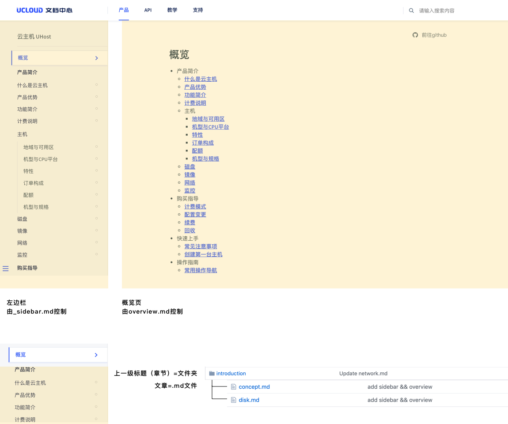
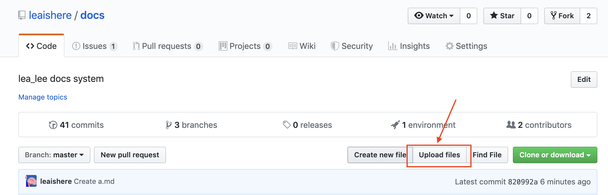
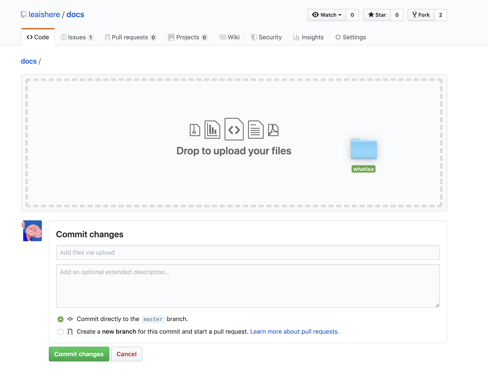
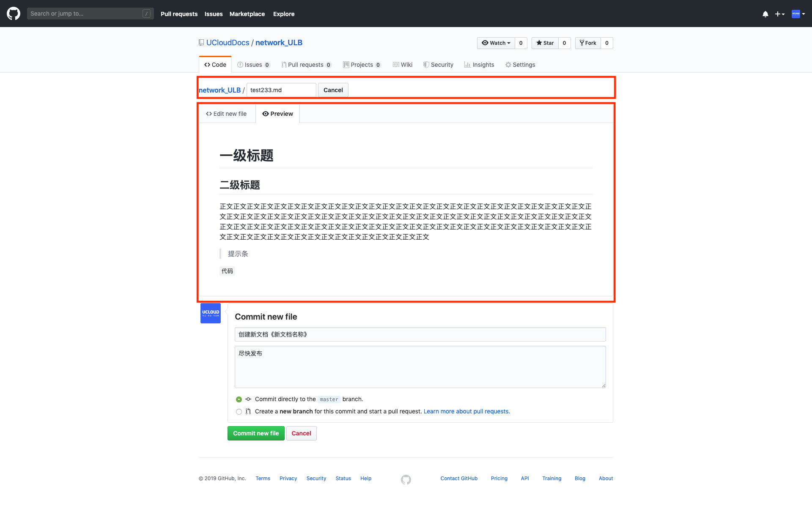
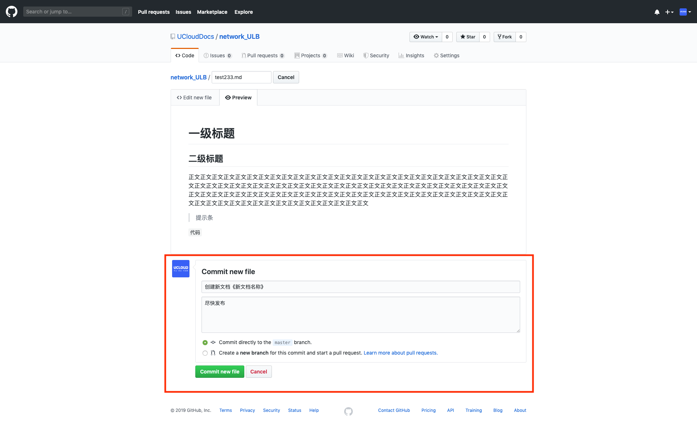

[<<返回](https://leaishere.github.io/docs_new/)

------

# 在github网页上创建文档

除了对线上文档的修改，产品经理还需要**_新增章节、小节或文章/新增产品小类/新增产品大类_**：

* **仅新增章节、小节或文章**：新建文件夹（章节、小节目录）或新建 _.md_ 文件（单篇文章）
* **仅新增产品小类**：联系主仓库管理者，新建仓库（产品小类）
* **新增产品大类**：在github侧完成仓库新建、文件添加后，联系平台产品经理在前端页面导航中增设大类
* **隐藏导航内产品目录**：联系平台产品经理  

# 那么，我们开始创作文档吧！

### 1. 新开文档

找到UCloudDocs账号，并进入目标仓库。在你所需创建文档的层级下，点击“create a new file”进入编辑页面。

### 2. 创建文档左边栏？创建_sidebar.md

请在仓库根目录下创建_sidebar.md文档，用于定义页面左边目录导航内文档目录。

> 增减/修改文档时，不要忘记更新这篇目录文件哦

### 3. 创建你的产品文档概览页？创建overview.md

请在仓库根目录下创建overview.md文档，用于定义文档下首篇“门面”。

> overview的命名是平台侧批量为旧仓库添加的时候自定义的，主要是考虑到不与仓库原index文档重名导致内容覆盖（影响PD再使用index内容）。由于新平台的左侧目录完全依赖_sidebar.md内无需列表来控制，所以仓库内所有内容的命名方式只要保证独一性、符合写法要求，如何命名是不受限制的。Freestyle任你选！

### 4. 如何管理文档用图？使用图库或仓库内新建images文件夹

- 绝对地址引用：[使用图床>>](http://docs.ucloudadmin.com/5b10f62667ded1519074449f/edit)
- 相对地址引用（规则不变）

> ### 新手求助：如何建images文件夹？
>
> 在需要创建文件夹的层级内，点击“upload files”进入上传界面。将本地建好的文件夹拖拽进功能区域，完成提交后即可创建好。
>
> 
>
> ------
>
> 
>
> ------
>
> 
>
> ------
>
> 

### 5. 创建第一篇文档

* 在路径上填入本篇文档名称（必须使用英文并添加后缀.md），开始在“edit”区域进行markdown写作。

  

* md样式预览：当前默认在“edit”标签下，可点击切换至“preview”查看样式预览；

* [Md语法说明](https://www.jianshu.com/p/40ba812dd973)

* [范例_ULB文档](https://github.com/UCloudDocs/UCloud-document/tree/master/network/ulb)

### 6. 提交新文件

编辑完成后，在“propose new file”模块写明本次创建请求。若为其他账号协作编辑，此模块可以向仓库拥有者说明情况。

### 7. 完成本次新增

仓库拥有者若直接在master分支上编辑，确认后改文档将直接出现在仓库列表里（如下图）。仓库中存在于master分支上的内容，都将在每次发布时被推送至线上。

