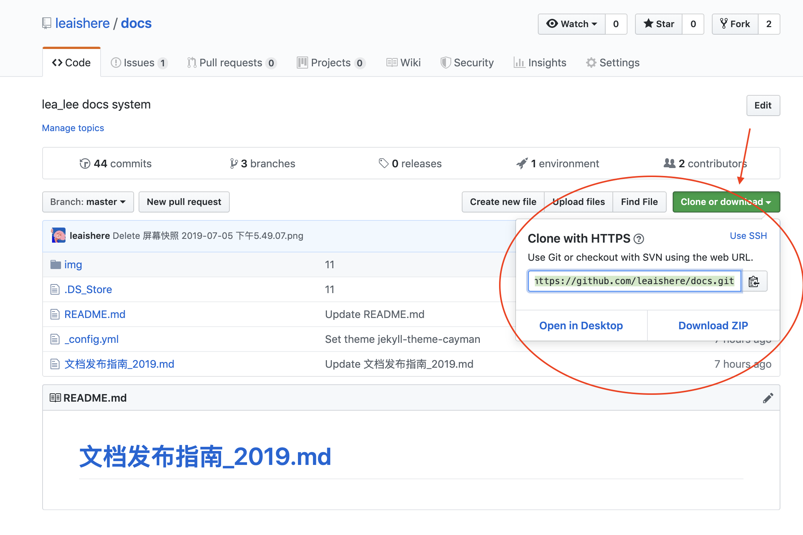
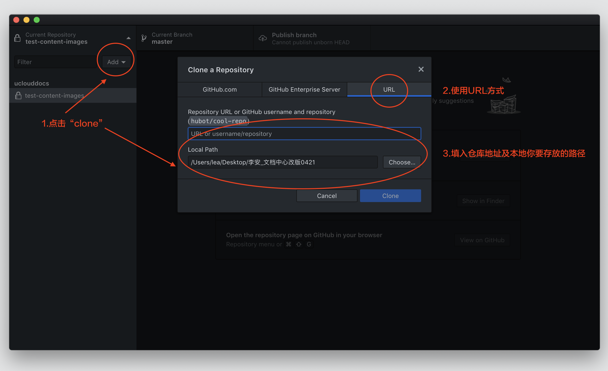
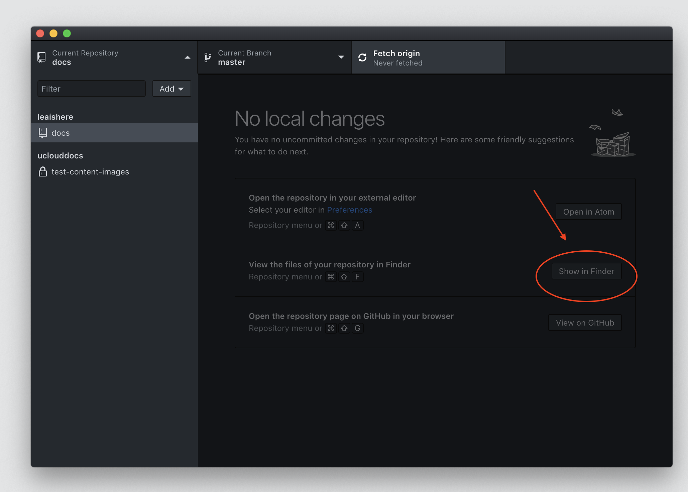
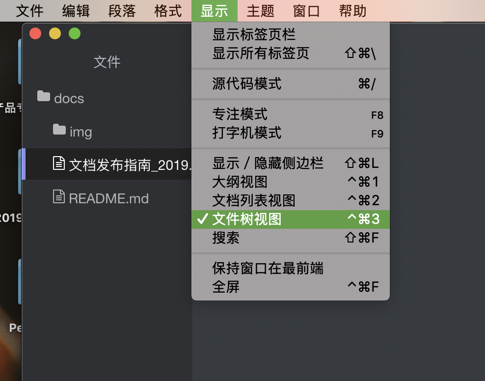
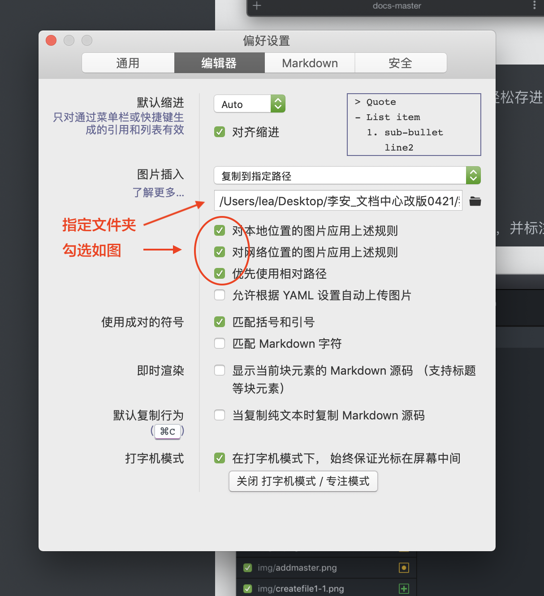
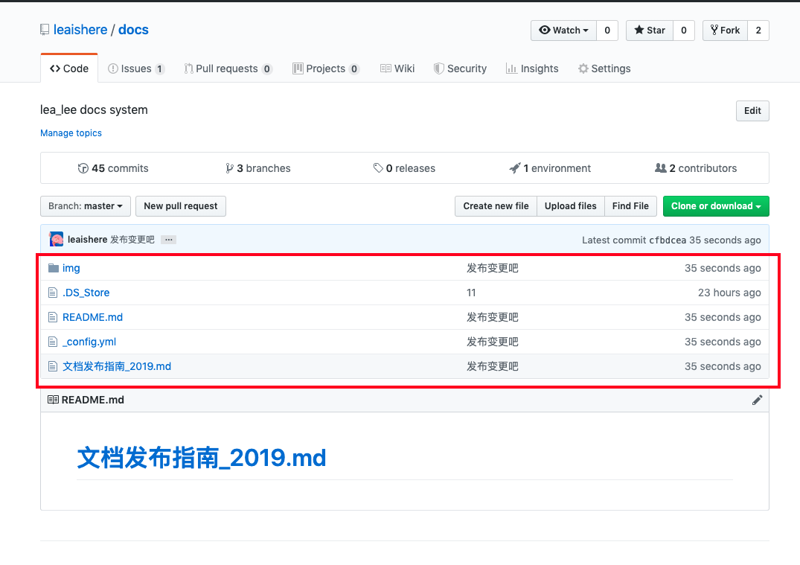

[<<返回](https://leaishere.github.io/docs_new/)

------

# 小编推荐-好用写作大法

github的玩法有很多，这里推荐一个作者常用的方法。

#### 6-1.下载顺手的工具

- 本地同步好帮手：[Gibhub客户端](https://desktop.github.com/)（win/osx）
- 轻便makdown编辑器：[Typora](https://www.typora.io/)（win/osx） 

#### 6-2. 克隆仓库

- 打开github客户端，登入你的github账号

- 将你的仓库克隆到本地。[ 找到你的产品仓库>>](https://github.com/UCloudDocs?tab=repositories)

  

- 在线上找到仓库地址，复制后填入github客户端弹窗内。点击确认后，仓库会克隆在本地。

  

* 仓库克隆成功后，在本地找到文件夹及目标".md"文档，开始用typora进行编辑

  

#### 6-3. 使用typora编辑文档

* 在编辑器中打开文档，使用markdown语法进行编辑

  

* 若未看到左侧导航，请从“显示”中打开“文件树状图”

  
  
* 通过简单设置，就可以将拖拽进文档的图片轻松存进images文件夹。[官方帮助文档>>](http://support.typora.io/Images/)

  

#### 6-4. 更新至线上仓库

- 变更完文档后，github客户端会检测到“变化”，并标注出来。你可以在界面中核对修改。

  

* 确认后，界面会提示你向线上仓库进行推送数据。

  

#### 6-5.前往线上仓库。Boom！仓库更新了哦。

