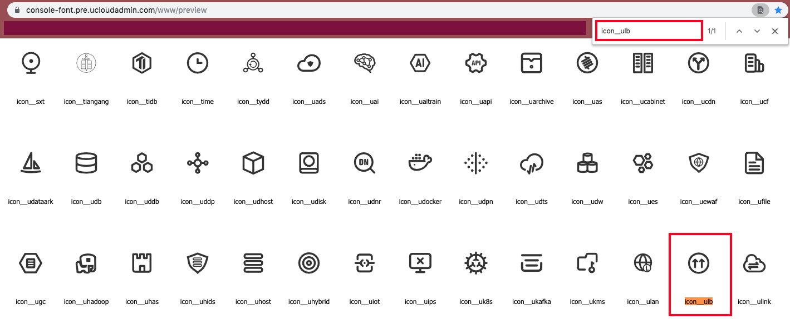

[<<返回](https://leaishere.github.io/docs_new/)

------

# 在左边栏增设产品icon
**【例】以ULB产品为例**

## Step1：确认"_sidebar.md" 文档首行写入class（如下图），其中“icon_productname”为产品icon在官网图标库的准确名称（前往[图标库](https://console-font.pre.ucloudadmin.com/www/preview)查看）

	
## Step2：请保证写入的图标名称与库内一致（如下图，可按产品名称在页内搜索）

  	
## Step3：图标名称写入正确后，前往[cms]()上检查PC/M是否显示正常。若无法显示，请优先确认名称是否正确。

